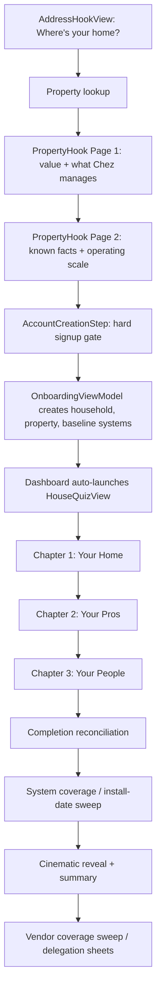

# Onboarding Quiz and Home Work Audit

Updated: 2026-04-28

This document maps the current homeowner onboarding quiz in live order and audits the home work inventory by operational type: routine, annual/one-off task, and handyman task.

Source files:

- `Haven/Core/Auth/Views/Onboarding/AddressHookView.swift`
- `Haven/Features/Onboarding/PropertyHook/PropertyHookView.swift`
- `Haven/Core/Auth/Views/Onboarding/AccountCreationStep.swift`
- `Haven/Features/Onboarding/HouseQuiz/HouseQuizQuestionLibrary.swift`
- `Haven/Features/Onboarding/HouseQuiz/HouseQuizAnswerMapper.swift`
- `Haven/Features/Property/Services/RoutineSeeder.swift`
- `Haven/Features/Property/Services/MaintenanceTemplates.swift`
- `PHASE-66-67-QUIZ-AUDIT.tsv`
- `PHASE-66-67-TASK-AUDIT.tsv`

## Definitions

| Type | Meaning | Where it lives | Product treatment |
| --- | --- | --- | --- |
| Routine | Frequent or recurring vendor rhythm, such as cleaning every 2 weeks, trash every Wednesday, pool weekly, pest quarterly. | `routines` table via `RoutineSeeder` and quiz vendor capture. | Calendar/service operating rhythm. Should not feel like a task wall. |
| Task | Annual, seasonal, warranty, safety, or value-preservation work, such as HVAC tune-up, roof inspection, dryer vent cleaning, septic pump. | `maintenance_tasks` seeded from `MaintenanceTemplates`. | Work item with due date, vendor/DIY routing, and completion history. |
| Handyman task | Low-effort punch-list work that can be batched into 1-2 handyman visits, such as caulking, GFCI checks, filter swaps, door hardware, minor repairs. | Mostly `Handyman` templates plus some adjacent category tasks. | Should roll up into "Next Handyman Visit" instead of showing as dozens of separate chores. |

## Onboarding Overview

## Live Quiz Route Map

Important: the live app has 41 possible questions. Several comments and the audit script are stale and still reference 30 or 37 questions. The four cadence questions `q11c`, `q12c`, `q14b`, and `q18b` are in the live app flow but currently land as `Unknown` in `PHASE-66-67-QUIZ-AUDIT.tsv` because the script order table is stale.

| # | ID | Chapter | Question | Shows when | Branch / side effect | Product disposition |
| --- | --- | --- | --- | --- | --- | --- |
| 1 | `q1_roof_material` | Your Home | What kind of roof do you have? | Always | Sets roof subtype and inspection cadence. | Keep |
| 2 | `q2_siding` | Your Home | What's your exterior siding? | Always | Captures exterior material for siding, washing, paint, and deck/exterior templates. | Keep |
| 3 | `q3_heating_fuel` | Your Home | How do you heat your home? | Always | Stores fuel type and narrows heating provider question later. | Keep |
| 4 | `q3b_hvac_type` | Your Home | What kind of HVAC system? | Always | Creates or updates HVAC system subtype and reconciles HVAC templates. | Keep |
| 5 | `q4_purchase` | Your Home | How did you get this home? | Always | Stores purchase kind and optional purchase price. | Reshape into property recap edit, not quiz burden |
| 6 | `q5_mortgage` | Your Home | Do you have a mortgage on this home? | Always | Stores `has_mortgage`; current UI renders like single choice despite `.yesNoLender`. | Cut from first quiz |
| 7 | `q6_water_source` | Your Home | Where does your water come from? | Always | Private/shared well creates Well System and well tasks. | Keep |
| 8 | `q7_sewer_septic` | Your Home | Sewer or septic? | Always | Septic creates Septic System and septic tasks. | Keep |
| 9 | `q8_water_heater` | Your Home | What kind of water heater do you have? | Always | Creates Water Heater subtype and tasks. | Keep |
| 10 | `q9_basement` | Your Home | Do you have a basement or crawl space? | Always | Basement creates sump pump; crawl creates Crawl Space. | Keep, add moisture/dehumidifier signal |
| 11 | `q10_appliances` | Your Home | Which major appliances do you have? | Always | Creates appliance systems and supports manual/doc upload. | Keep, fix stale attribute name |
| 12 | `q20_other_fuels` | Your Home | Any other fuel sources? | Always | Fireplace/stove/wood/pellet answers drive Fireplace/Chimney context. | Keep |
| 13 | `q21_solar` | Your Home | Solar panels? | Always | Creates Solar system. | Keep |
| 14 | `q22_generator` | Your Home | Whole-home generator? | Always | Inline type/fuel/provider flow creates Generator and provider context. | Keep |
| 15 | `q36_diy_vs_vendor` | Your Pros | How do you want to handle home maintenance? | Always | Sets `vendor_preference_tier`; reconciler uses it for DIY/vendor/handyman routing. | Keep, but copy should emphasize "how much do you want Chez to handle?" |
| 16 | `q11_lawn` | Your Pros | Do you have a lawn? | Always | If pro, captures landscaping provider. If hardscape, later exposes hardscape vendor chip. | Keep |
| 17 | `q11b_lawn_type` | Your Pros | Natural grass, turf, or both? | Skips if Q11 is `no_lawn`, `garden`, or `hardscape`. | Natural/turf/mixed drives landscaping and turf templates. | Keep |
| 18 | `q11c_landscaping_months` | Your Pros | Which months does your landscaping crew usually come? | Shows only if Q11 is `pro` and provider context exists. | Stores active months and updates landscaping routine. | Keep, add cadence/day/time |
| 19 | `q12_pool` | Your Pros | Pool or hot tub? | Always | Pool/hot tub presence; non-none paths capture pool provider. | Keep |
| 20 | `q12b_pool_chemistry` | Your Pros | Saltwater or chlorine? | Shows for in-ground, above-ground, or both. Skips for hot tub only or none. | Sets pool chemistry subtype. | Keep |
| 21 | `q12c_pool_months` | Your Pros | Which months does your pool company cover? | Shows for pool answers with provider context. | Stores active months and updates pool routine. | Keep, add cadence/day/time if not weekly |
| 22 | `q13_pest` | Your Pros | Pest control? | Always | Recurring pro or termite bond captures pest provider and routes pest tasks. | Keep, add cadence because "recurring" may be monthly, bimonthly, quarterly |
| 23 | `q14_irrigation` | Your Pros | Sprinkler or irrigation? | Skips only if Q11 is `no_lawn`. | Full/drip captures irrigation provider and creates Irrigation. | Keep |
| 24 | `q14b_irrigation_months` | Your Pros | Which months does the irrigation system usually run? | Shows for full/drip with provider context. | Stores active months and updates irrigation routine. | Keep |
| 25 | `q15_security` | Your Pros | Security or alarm system? | Always | Monitored path captures provider and creates Security System. | Keep optional |
| 26 | `q15b_household_contractors` | Your Pros | Got any pros on speed dial? | Always, but chip visibility is filtered. | Creates contractors, preferred handyman, active routines, or `needs_vendor_*` flags. | Keep, but make handyman-first and ask first-visit scope |
| 27 | `q16_electric` | Your People | Who's your electric provider? | Always. | Creates utility account. | Optional/defer unless needed for vault setup |
| 28 | `q17_internet` | Your People | Internet provider? | Always. | Creates utility account. | Optional/defer |
| 29 | `q18_trash` | Your People | Trash & recycling? | Always. | Private path captures hauler provider. | Keep |
| 30 | `q18b_trash_day` | Your People | Which days should Chez remind you about pickup? | Shows after Q18 unless Q18 is `not_sure`. | Stores pickup weekdays and creates trash routine. | Keep, split trash/recycling/yard waste later |
| 31 | `q19_heating_provider` | Your People | Heating fuel provider? | Skips for electric, geothermal, or not-sure fuel. Shows oil/propane/natural gas. | Captures fuel provider utility account. | Keep if oil/propane/gas delivery matters |
| 32 | `q23_vehicle_count` | Your People | How many cars do you own? | Always. | 0 skips vehicle add. | Cut from homeowner first quiz |
| 33 | `q24_vehicle_add` | Your People | Add your primary car | Shows when vehicle count is non-zero. | VIN/vehicle creation. | Cut from homeowner first quiz |
| 34 | `q25_garage_ev` | Your People | What kind of garage do you have? | Always. | Garage answer creates Garage Door context. | Keep if reframed as home system, not vehicle flow |
| 35 | `q25b_ev_charger` | Your People | Do you have a Level 2 EV charger? | Skips if Q25 is `none`. | Creates EV charger/electrical context. | Keep optional |
| 36 | `q26_auto_insurance` | Your People | Auto insurance provider? | Always. | Creates provider/account/doc context. | Cut from homeowner first quiz |
| 37 | `q27_homeowners_insurance` | Your People | Homeowners insurance provider? | Always. | Creates home insurance utility/provider doc context. | Keep optional because it supports home claims and vendor docs |
| 38 | `q28_household` | Your People | Who lives here, and who else helps? | Always. | Inline household/caretaker/home-manager flow. | Keep, but make it about access, notifications, and who can approve work |
| 39 | `q28b_pets` | Your People | Any pets in the household? | Always. | Sets pet flags and vendor awareness. | Keep |
| 40 | `q29_estate_docs` | Your People | Estate documents you have on hand? | Always in current app. | Estate doc checklist. | Cut completely |
| 41 | `q30_priorities` | Your People | What matters most? What worries you most? | Always. | Stores generic priorities. | Reshape into "what should Chez optimize first?" |

## Q15b Contractor Chip Routes

| Chip | Shows when | Data effect |
| --- | --- | --- |
| Handyman | Always | Creates contractor if provided, stamps preferred handyman, sets `handyman_preference`. No active routine is created immediately; handyman routine is lazy-created by Day1TaskCurator. |
| House cleaner | Always | Creates contractor and cleaning routine if provider is captured. |
| HVAC service | Always | Creates HVAC contractor and active HVAC routine/program. |
| Plumber | Always | Creates Plumbing contractor. |
| Electrician | Always | Creates Electrical contractor. |
| Roofer | Always | Creates Roofing contractor. |
| Tree service | Always | Creates Tree Service contractor and routine context. |
| Mosquito & tick | Always | Creates Mosquito & Tick contractor/routine. |
| Snow removal | Only in snow states | Creates Snow Removal contractor/routine. |
| Pet waste | Only if pet flag already exists before Q15b | Creates Pet Waste contractor/routine. First-pass onboarding usually cannot see this because Q28b comes later. |
| Septic pumper | Only if Q7 is septic | Creates Septic System contractor. |
| Well water service | Only if Q6 is private/shared well | Creates Well System contractor. |
| Chimney sweep | If fireplace/fuel signal exists | Creates Chimney contractor. |
| Hardscape / masonry | Only if Q11 is hardscape | Creates Landscaping-category hardscape contractor. |
| Generator service | Only if Q22 captured a generator | Creates Generator contractor/routine. |

## Quiz Cleanup Notes

- Remove estate language and `q29_estate_docs` entirely.
- Fix stale comments that say the quiz is 30 or 37 questions.
- Update `scripts/audit_quiz_questions.py` so `q11c`, `q12c`, `q14b`, and `q18b` are in the correct chapter/order.
- Rename `appliances_under_5_years`; Q10 asks what appliances exist, not appliance age.
- Either remove `q5_mortgage` or implement the lender field honestly. In the current view, `.yesNoLender` falls through to `singleChoiceBody`.
- Add missing routine cadence capture for cleaning, landscaping, pest, pool, trash/recycling, irrigation, snow, pet waste, and mosquito/tick.
- Add a first handyman visit scope question before quiz completion.
- Add a "last done / last serviced" screen for high-value annual tasks.

## Routine Inventory

These are recurring service programs, not one-off tasks. They are created from contractors, provider answers, trash-day answers, and post-quiz systemless routine seeding.

| Routine | Default cadence | Default day/time | Active months | Source path |
| --- | --- | --- | --- | --- |
| Cleaning / housekeeping | Biweekly | Wednesday 9:00 AM | Year-round | Q15b cleaning contractor or contractor seeding |
| Landscaping | Weekly | Wednesday 8:00 AM | April-November | Q11 pro provider, Q15b, contractor seeding |
| Trash and recycling | Weekly | Wednesday 7:00 PM | Year-round | Q18/Q18b, systemless routine seeding |
| Pool service | Weekly | Tuesday 10:00 AM | May-September | Q12 provider, contractor seeding |
| Pest control | Every 90 days | No default weekday | Year-round | Q13 provider, contractor seeding |
| Pet waste pickup | Weekly | Wednesday 8:00 AM | Year-round | Q15b or pet-gated systemless routine |
| Mosquito and tick spraying | Triweekly | Tuesday | April-October | Q15b or systemless routine |
| Snow removal contract | Every 90 days as seasonal check-in | No default weekday | December-April | Q15b in snow states or systemless routine |
| Irrigation program | Annual | No default weekday | March-November | Q14/Q14b provider or contractor seeding |
| Security and smart-home program | Annual | No default weekday | Year-round | Q15 monitored provider or contractor seeding |
| HVAC program | Annual | No default weekday | Year-round | Q15b HVAC contractor or contractor seeding |
| Generator program | Annual | No default weekday | Year-round | Q22/Q15b generator provider |
| Handyman recurring | On-demand placeholder | No default cadence | Year-round | Day1TaskCurator lazy-creates when routing handyman tasks |

## Maintenance Template Summary

Current row-level template inventory: 146 templates.

| Classification | Count | Meaning |
| --- | ---: | --- |
| Handyman task | 41 | Explicit `Handyman` templates intended for spring/fall/on-demand handyman bundles. |
| Recurring template | 12 | Maintenance templates with weekly, semi-annual, monthly, or quarterly frequency. These are still task templates, not `routines`. Some may be candidates to become routines later. |
| Task | 93 | Annual, seasonal, multi-year, safety, warranty, or one-off maintenance tasks. |

Category counts: Roofing 7, Siding/Exterior 6, HVAC 10, Plumbing 2, Water Heater 4, Septic System 2, Well System 2, Electrical 7, Chimney 3, Windows 1, Garage Door 3, Landscaping 18, Irrigation 3, Pool/Spa 8, Appliance 3, Pest Control 1, Generator 4, Security System 2, Solar 2, Crawl Space 3, Handyman 41, Snow Removal 1, Mosquito & Tick 1, Tree Service 3, Window Cleaning 1, Pressure Washing 1, Driveway Sealcoating 1, Attic & Foundation 1, Elevator 2, Wine Cellar 1, Air Quality 2.

## Complete Maintenance Template Inventory

Full cost, routing, description, bundle, safety, and subtype detail lives in `PHASE-66-67-TASK-AUDIT.tsv`. This table is the visual inventory by category, title, operational type, season, and cadence.

| Category | Work item | Type | Season | Cadence |
| --- | --- | --- | --- | --- |
| Roofing | Annual roof inspection | Task | Fall | Annually |
| Roofing | Check for damaged shingles | Recurring template | Spring | Semi-annually |
| Roofing | Reseal flashing and seams | Task | Spring | Annually |
| Roofing | Treat moss and algae | Task | Fall | Annually |
| Roofing | Clean gutters and downspouts | Recurring template | Spring | Semi-annually |
| Roofing | Inspect flashing around chimney/vents | Task | Fall | Annually |
| Roofing | Inspect attic ventilation and insulation | Task | Fall | Every 2 years |
| Siding/Exterior | Power wash exterior siding | Task | Spring | Annually |
| Siding/Exterior | Deck and patio annual service | Task | Spring | Annually |
| Siding/Exterior | Exterior paint touch-up walkaround | Task | Spring | Annually |
| Siding/Exterior | Deck or fence staining | Task | Spring | Every 2-3 years |
| Siding/Exterior | Exterior painting refresh | Task | Summer | Every 10 years |
| Siding/Exterior | Driveway seal coat | Task | Fall | Every 2-3 years |
| HVAC | HVAC tune-up (cooling) | Task | Spring | Annually |
| HVAC | HVAC tune-up (heating) | Task | Fall | Annually |
| HVAC | Inspect ductwork for leaks | Task | Any | Every 2-3 years |
| HVAC | Inspect mini-split outdoor unit | Task | Spring | Annually |
| HVAC | Bleed radiators | Task | Fall | Annually |
| HVAC | Annual boiler service | Task | Fall | Annually |
| HVAC | Geothermal loop pressure check | Task | Any | Annually |
| HVAC | Air duct cleaning | Task | Any | Every 3-5 years |
| HVAC | Flush HVAC condensate drain line | Task | Spring | Annually |
| HVAC | Whole-home humidifier service | Task | Fall | Annually |
| Plumbing | Drain cleaning | Task | Any | Every 2 years |
| Plumbing | Test sump pump battery backup | Recurring template | Spring | Semi-annually |
| Water Heater | Flush water heater | Task | Any | Annually |
| Water Heater | Inspect anode rod | Task | Any | Every 3 years |
| Water Heater | Test T&P relief valve | Task | Any | Annually |
| Water Heater | Descale tankless heater | Task | Any | Annually |
| Septic System | Septic tank pumping | Task | Any | Every 3-5 years |
| Septic System | Inspect septic baffles | Task | Any | Every 3-5 years |
| Well System | Test water quality | Task | Spring | Annually |
| Well System | Well system inspection | Task | Any | Every 3-5 years |
| Electrical | Replace smoke detectors | Task | Any | Every 10 years |
| Electrical | Inspect electrical panel | Task | Any | Every 3 years |
| Electrical | EV charger inspection | Task | Any | Annually |
| Electrical | IR scan of main electrical panel | Task | Any | Every 3 years |
| Electrical | Heat cable inspection | Task | Fall | Annually |
| Electrical | Outdoor lighting system service | Task | Spring | Annually |
| Electrical | Fire extinguisher annual check | Task | Spring | Annually |
| Chimney | Annual chimney sweep | Task | Fall | Annually |
| Chimney | Inspect chimney cap and crown | Task | Fall | Annually |
| Chimney | Annual gas fireplace service | Task | Fall | Annually |
| Windows | Schedule exterior window re-caulking | Task | Fall | Every 2-3 years |
| Garage Door | Test garage door auto-reverse | Task | Any | Annually |
| Garage Door | Lubricate garage door tracks and hardware | Task | Any | Annually |
| Garage Door | Annual garage door tune-up | Task | Any | Annually |
| Landscaping | Mulch garden beds | Task | Spring | Annually |
| Landscaping | Prune shrubs and hedges | Recurring template | Spring | Semi-annually |
| Landscaping | Fertilize natural lawn | Recurring template | Spring | Quarterly |
| Landscaping | Core aerate natural lawn | Task | Fall | Annually |
| Landscaping | Overseed bare patches | Task | Fall | Annually |
| Landscaping | Pre-emergent weed control | Task | Spring | Annually |
| Landscaping | Dethatch lawn | Task | Spring | Annually |
| Landscaping | Soil pH test and lime application | Task | Fall | Every 2 years |
| Landscaping | Fall leaf cleanup | Task | Fall | Annually |
| Landscaping | Top up turf infill | Task | Spring | Annually |
| Landscaping | Power rake and groom turf | Recurring template | Spring | Semi-annually |
| Landscaping | Deep clean synthetic turf | Task | Spring | Every 2 years |
| Landscaping | Outdoor lighting service | Task | Spring | Annually |
| Landscaping | Arborist tree health inspection | Task | Fall | Annually |
| Landscaping | Pressure wash patio and walkways | Task | Spring | Annually |
| Landscaping | Top up joint sand in pavers | Task | Summer | Every 2 years |
| Landscaping | Treat weeds between pavers | Recurring template | Spring | Quarterly |
| Landscaping | Check hardscape drainage and grading | Task | Fall | Annually |
| Irrigation | Winterize irrigation system | Task | Fall | Annually |
| Irrigation | Spring startup irrigation | Task | Spring | Annually |
| Irrigation | Backflow preventer test | Task | Spring | Annually |
| Pool/Spa | Pool opening service | Task | Spring | Annually |
| Pool/Spa | Pool closing and winterization | Task | Fall | Annually |
| Pool/Spa | Inspect pool equipment | Task | Spring | Annually |
| Pool/Spa | Pool heater service | Task | Spring | Annually |
| Pool/Spa | Test and sanitize hot tub water | Recurring template | Any | Weekly |
| Pool/Spa | Drain and refill hot tub | Recurring template | Any | Quarterly |
| Pool/Spa | Inspect hot tub cover and jets | Task | Spring | Annually |
| Pool/Spa | Pool safety fence inspection | Task | Spring | Annually |
| Appliance | Clean dryer vent duct | Task | Any | Annually |
| Appliance | Replace refrigerator water filter | Recurring template | Any | Semi-annually |
| Appliance | Built-in grill service | Task | Spring | Annually |
| Pest Control | Termite inspection | Task | Spring | Annually |
| Generator | Change generator oil | Task | Any | Annually |
| Generator | Replace spark plugs | Task | Any | Annually |
| Generator | Annual generator service | Task | Fall | Annually |
| Generator | Test automatic transfer switch | Task | Any | Annually |
| Security System | Annual security system check | Task | Any | Annually |
| Security System | Replace sensor batteries | Task | Any | Annually |
| Solar | Solar panel cleaning | Task | Any | Annually |
| Solar | Solar system inspection | Task | Any | Every 3-5 years |
| Crawl Space | Check vapor barrier condition | Task | Any | Annually |
| Crawl Space | Inspect for mold or mildew | Task | Any | Annually |
| Crawl Space | Check foundation for cracks | Task | Spring | Annually |
| Handyman | Spring handyman visit | Handyman task | Spring | Annually |
| Handyman | Fall handyman visit | Handyman task | Fall | Annually |
| Handyman | Test smart water leak system | Handyman task | Spring | Annually |
| Handyman | Service central vacuum system | Handyman task | Fall | Annually |
| Handyman | Verify radon mitigation fan | Handyman task | Fall | Annually |
| Handyman | Replace smoke & CO detector batteries | Handyman task | Spring | Semi-annually |
| Handyman | Inspect exterior caulking around windows & doors | Handyman task | Spring | Annually |
| Handyman | Foundation walkaround: cracks and grading | Handyman task | Spring | Annually |
| Handyman | Check washing machine supply hoses | Handyman task | Spring | Annually |
| Handyman | Test sump pump function | Handyman task | Spring | Annually |
| Handyman | Test GFCI outlets throughout house | Handyman task | Spring | Annually |
| Handyman | Test smoke and CO detector alarms | Handyman task | Spring | Semi-annually |
| Handyman | Replace HVAC filter (cooling season) | Handyman task | Spring | Semi-annually |
| Handyman | Ceiling fan direction switch (summer) | Handyman task | Spring | Semi-annually |
| Handyman | Reopen exterior faucets post-winter | Handyman task | Spring | Annually |
| Handyman | Replace smoke & CO detector batteries | Handyman task | Fall | Semi-annually |
| Handyman | Winterize outdoor faucets and hose bibs | Handyman task | Fall | Annually |
| Handyman | Drain and store exterior hoses | Handyman task | Fall | Annually |
| Handyman | Inspect weatherstripping pre-heating season | Handyman task | Fall | Annually |
| Handyman | Pre-winter foundation and gutter walkaround | Handyman task | Fall | Annually |
| Handyman | Check attic insulation coverage | Handyman task | Fall | Annually |
| Handyman | Test smoke and CO detector alarms | Handyman task | Fall | Semi-annually |
| Handyman | Replace HVAC filter (heating season) | Handyman task | Fall | Semi-annually |
| Handyman | Ceiling fan direction switch (winter) | Handyman task | Fall | Semi-annually |
| Handyman | Pipe insulation check in unheated spaces | Handyman task | Fall | Annually |
| Handyman | Interior paint touch-up walkaround | Handyman task | Spring | Annually |
| Handyman | Cabinet and door hardware tune-up | Handyman task | Any | Annually |
| Handyman | Smart home battery sweep | Handyman task | Any | Semi-annually |
| Handyman | Whole-house relamping | Handyman task | Fall | Annually |
| Handyman | Ceiling fan cleaning and balancing | Handyman task | Spring | Annually |
| Handyman | Drywall patch and paint touch-up visit | Handyman task | Any | Annually |
| Handyman | Door, latch, and hinge tune-up | Handyman task | Any | Annually |
| Handyman | Window screen and hardware repair | Handyman task | Spring | Annually |
| Handyman | Interior caulk refresh | Handyman task | Any | Annually |
| Handyman | Hang mirrors, art, and shelving | Handyman task | Any | Annually |
| Handyman | TV mounting and cord cleanup | Handyman task | Any | Annually |
| Handyman | Furniture, playset, or shed assembly | Handyman task | Spring | Annually |
| Handyman | Grab bar and safety hardware install | Handyman task | Any | Annually |
| Handyman | Fixture swap and hardware refresh | Handyman task | Any | Annually |
| Handyman | Fence, gate, and deck repair sweep | Handyman task | Spring | Annually |
| Handyman | Blind and curtain hardware install | Handyman task | Any | Annually |
| Snow Removal | Renew snow plowing contract | Task | Fall | Annually |
| Mosquito & Tick | Sign up for mosquito and tick season | Task | Spring | Annually |
| Tree Service | Annual tree assessment | Task | Spring | Annually |
| Tree Service | Pruning and crown thinning | Task | Winter | Every 3 years |
| Tree Service | Trim trees away from roof | Task | Fall | Annually |
| Window Cleaning | Exterior window washing | Recurring template | Spring/Fall | Semi-annually |
| Pressure Washing | Annual exterior power washing | Task | Spring | Annually |
| Driveway Sealcoating | Asphalt driveway sealcoat | Task | Fall | Every 2-3 years |
| Attic & Foundation | Annual attic inspection | Task | Fall | Annually |
| Elevator | Annual elevator inspection | Task | Any | Annually |
| Elevator | Quarterly elevator service | Recurring template | Any | Quarterly |
| Wine Cellar | Annual cooling unit service | Task | Spring | Annually |
| Air Quality | Annual radon test | Task | Any | Every 2 years |
| Air Quality | Service whole-home or basement dehumidifier | Task | Spring | Annually |

## Product Gaps From This Map

1. The quiz captures many home facts, but not enough routine cadence. Cleaning, landscaping, pool, pest, snow, pet waste, mosquito/tick, and irrigation should collect "how often, which day, what time/window, active season, access notes."
2. The app has strong handyman inventory, but the quiz does not ask for first-visit scope. Add a dedicated first handyman visit question.
3. Annual/value tasks need "last done" dates. HVAC, gutters, chimney, dryer vent, septic, well water test, roof, crawl space, power washing, pest, and generator should have quick "last serviced / not sure" capture.
4. Estate, vehicle, auto insurance, mortgage, and broad financial questions should not be in the homeowner first quiz.
5. Completion should resolve into a Home Operating Plan: routines, annual maintenance, first handyman visit, and missing vendors.
